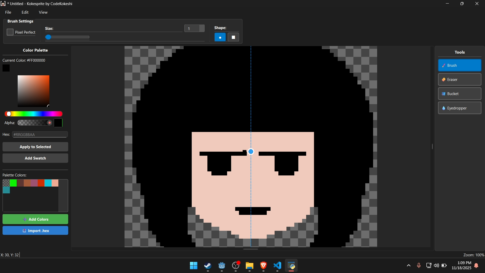

# Kokesprite - Pixel Art Editor

**Version 0.1.0**

A lightweight, feature-rich pixel art editor focused on pixel-perfect drawing, responsive UI, and professional-quality tools. Built with PyQt6 for a native desktop feel and designed for artists who want precise control over pixels, cursors, and symmetry.

**Demo**

[](https://www.youtube.com/watch?v=o6BtIGVkHu4 "Kokesprite - Trying to recreate Aseprite in Python from Scratch")

---

## Features

### Core Canvas & Tools
- **Pixel-perfect canvas** with configurable zoom (default 8x)
- **Drawing tools**: Brush, Eraser, Bucket Fill, Eyedropper
- **Brush options**: Size (1-50px), Shape (circle/square), Pixel-perfect toggle
- **High-quality eraser**: True transparency with alpha-channel preservation
- **Undo/Redo history**: Snapshot-based history system

### Advanced Symmetry System
- **Rotatable symmetry lines** at any angle (0-359 degrees) - not limited to H/V
- **Stack up to 8 lines** for complex patterns (cross, X, star, custom)
- **Draggable centers**: Click and drag symmetry line origins anywhere on canvas
- **Presets**: Vertical, Horizontal, Cross (+), Diagonal (X), Star (8-way)
- **Tool integration**: Works seamlessly with brush and eraser
- **Visual feedback**: Cursor changes to open/closed hand when dragging

### Cursor & Preview System
- **Aseprite-style brush cursor** with pixel-accurate outlines
- **Eraser preview** with inverted-edge outline for clarity
- **Zoom-aware**: Cursor scales correctly with zoom level
- **Dynamic updates**: Reflects current brush size and shape in real-time

### Background & Grid
- **Checkered background**: User-configurable tile sizes, zoom-aware rendering
- **Grid overlay**: Configurable cell size and color
- **Settings dialogs**: Easy customization via View menu

### UI & Panels
- **Main window** with integrated panels: Tools, Options, Color Palette
- **Start screen** for quick project setup
- **New File dialog** with preset canvas sizes
- **Intuitive menus**: File, View, Edit with keyboard shortcuts

---

## Project Structure

```
Kokesprite/
 main.py                  # Application entry point
 convert_icon.py          # Icon conversion utility (PNG to ICO)
 Kokesprite.spec          # PyInstaller build configuration
 requirements.txt         # Python dependencies
 icon.png                 # Source icon (256x256 recommended)

 src/
    canvas.py            # Canvas widget, drawing, tools, cursor logic
    symmetry.py          # Symmetry engine (lines, mirroring math)
    symmetry_options.py  # Symmetry options panel UI
    main_window.py       # MainWindow, menus, dialogs
    tools_panel.py       # Tools panel (brush/eraser/bucket/eyedropper)
    options_panel.py     # Brush options panel (size/shape/pixel-perfect)
    color_palette_panel.py  # Color picker palette
    history.py           # Undo/redo history manager
    start_screen.py      # Start screen with new file button
    new_file_dialog.py   # New canvas dialog
    system_eyedropper.py # System-wide eyedropper tool

 .venv/                   # Virtual environment (gitignored)
```

**Generated files** (gitignored):
- icon.ico - Multi-resolution Windows icon (generated from icon.png)
- build/ - PyInstaller temporary build files
- dist/Kokesprite.exe - Final executable

---

## Quick Start

### Prerequisites
- Python 3.13+ (earlier versions may work but untested)
- Windows (primary target platform)

### Development Setup

1. **Clone the repository**
```powershell
git clone https://github.com/CodeKokeshi/Kokesprite.git
cd Kokesprite
```

2. **Create and activate virtual environment**
```powershell
python -m venv .venv
.\.venv\Scripts\Activate.ps1
```

3. **Install dependencies**
```powershell
pip install -r requirements.txt
```

4. **Run the application**
```powershell
python main.py
```

### Troubleshooting: ModuleNotFoundError

**Problem**: `ModuleNotFoundError: No module named 'PyQt6'` when running the application.

**Cause**: You're using the system Python instead of the virtual environment.

**Solutions**:

1. **Via Command Line**: Always activate the virtual environment first:
   ```powershell
   .\.venv\Scripts\Activate.ps1
   python main.py
   ```

2. **In VS Code**: Configure VS Code to use the virtual environment:
   - Click the Python version in the bottom-right status bar
   - Select the interpreter: `.venv\Scripts\python.exe`
   - Or create `.vscode/settings.json` with:
     ```json
     {
         "python.defaultInterpreterPath": "${workspaceFolder}\\.venv\\Scripts\\python.exe"
     }
     ```
   - Reload VS Code window (Ctrl+Shift+P → "Reload Window")
   - Now "Run Python File" button will work correctly!

---

## Building Executable

### Icon Conversion (if icon.png changed)

**For best quality, use 256x256 or larger icon.png!** Small icons will be upscaled but look pixelated at large sizes.

```powershell
python convert_icon.py
```

This generates icon.ico with multiple Windows-standard resolutions (16x16 to 256x256).

### Build the EXE

```powershell
python -m PyInstaller Kokesprite.spec --clean
```

**Output**: dist/Kokesprite.exe (single-file executable, ~30-50MB)

The --clean flag ensures a fresh build by removing temporary files.

### Build Configuration

The Kokesprite.spec file controls:
- **One-file mode**: Everything packed into single EXE
- **No console**: GUI-only, no command window
- **Icon embedding**: Uses icon.ico for executable icon
- **Data files**: Embeds icon.ico and icon.png for runtime window icon
- **UPX compression**: Reduces file size
- **Hidden imports**: Ensures PyQt6 modules are included

### Distribution

Simply distribute dist/Kokesprite.exe - it's a standalone executable with everything bundled!

Users can double-click to run without installing Python or dependencies.

### Troubleshooting Builds

If build fails:
1. Ensure virtual environment is activated
2. Check icon.ico exists (run convert_icon.py)
3. Delete build/ and dist/ folders and retry
4. Verify all imports are available in environment

**Note**: 30-50MB EXE size is normal for PyQt6 applications (includes Python interpreter + Qt framework).

---

## Roadmap

- [ ] **Layers system** with layer panel
- [ ] **Visual symmetry editor** with drag/rotate handles
- [ ] **Save/Load** brush, palette, and symmetry presets
- [ ] **File I/O** for saving/loading projects
- [ ] **Export** to PNG/GIF with transparency
- [ ] **Animation timeline** for sprite animations
- [ ] **Installer creation** (MSI or similar) for distribution
- [ ] **macOS and Linux support**

---

## Contributing

Contributions welcome! Please:

1. Fork the repository
2. Create a feature branch (git checkout -b feature/amazing-feature)
3. Commit changes (git commit -m 'Add amazing feature')
4. Push to branch (git push origin feature/amazing-feature)
5. Open a Pull Request

Please follow existing code style (PyQt6 idioms) and keep UI consistent.

---

## License

This project is licensed under the MIT License - see the LICENSE file for details.

---

## Links

- **Repository**: [github.com/CodeKokeshi/Kokesprite](https://github.com/CodeKokeshi/Kokesprite)
- **Issues**: [Report bugs or request features](https://github.com/CodeKokeshi/Kokesprite/issues)

---

*Built with love using PyQt6*
